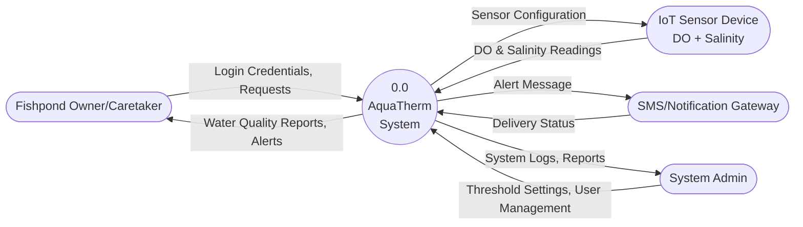
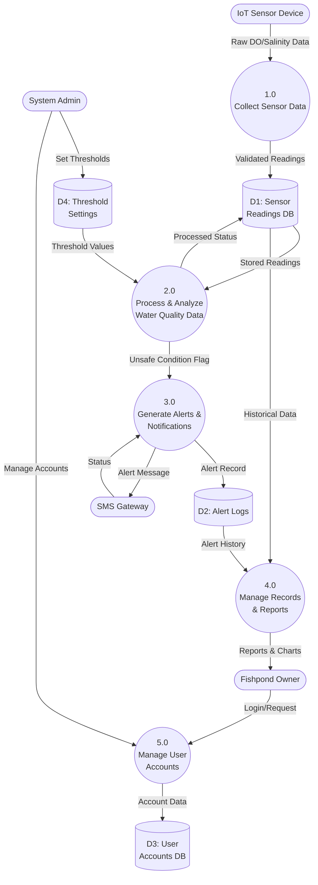
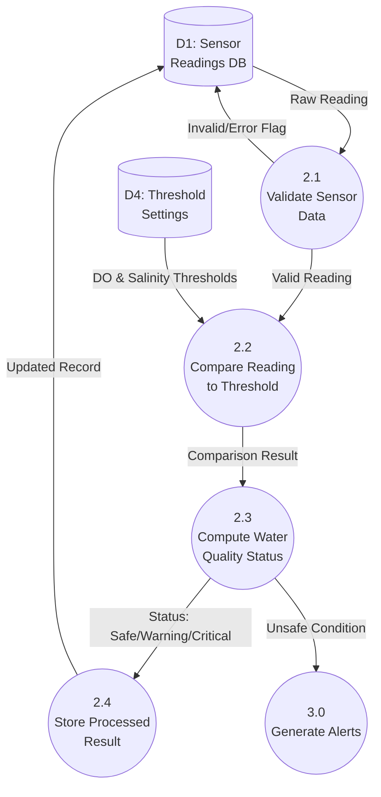

# Data Flow Diagram (DFD) — AquaTherm

## Level 0 — Context Diagram

```mermaid
flowchart LR
    Owner([Fishpond Owner/Caretaker])
    Sensor([IoT Sensor Device<br/>DO + Salinity])
    SMSGate([SMS/Notification Gateway])
    Admin([System Admin])

    Owner -->|Login Credentials, Requests| System((0.0<br/>AquaTherm<br/>System))
    System -->|Water Quality Reports, Alerts| Owner
    Sensor -->|DO & Salinity Readings| System
    System -->|Sensor Configuration| Sensor
    System -->|Alert Message| SMSGate
    SMSGate -->|Delivery Status| System
    Admin -->|Threshold Settings, User Management| System
    System -->|System Logs, Reports| Admin
```

---

## Level 1 — Main Processes

```mermaid
flowchart TD
    Owner([Fishpond Owner])
    Sensor([IoT Sensor Device])
    SMSGate([SMS Gateway])
    Admin([System Admin])

    P1((1.0<br/>Collect Sensor Data))
    P2((2.0<br/>Process & Analyze<br/>Water Quality Data))
    P3((3.0<br/>Generate Alerts &<br/>Notifications))
    P4((4.0<br/>Manage Records<br/>& Reports))
    P5((5.0<br/>Manage User<br/>Accounts))

    D1[(D1: Sensor<br/>Readings DB)]
    D2[(D2: Alert Logs)]
    D3[(D3: User<br/>Accounts DB)]
    D4[(D4: Threshold<br/>Settings)]

    Sensor -->|Raw DO/Salinity Data| P1
    P1 -->|Validated Readings| D1
    D1 -->|Stored Readings| P2
    D4 -->|Threshold Values| P2
    P2 -->|Processed Status| D1
    P2 -->|Unsafe Condition Flag| P3
    P3 -->|Alert Record| D2
    P3 -->|Alert Message| SMSGate
    SMSGate -->|Status| P3
    D1 -->|Historical Data| P4
    D2 -->|Alert History| P4
    P4 -->|Reports & Charts| Owner
    Owner -->|Login/Request| P5
    P5 -->|Account Data| D3
    Admin -->|Set Thresholds| D4
    Admin -->|Manage Accounts| P5
```

---

## Level 2 — Decomposition of Process 2.0 (Process & Analyze Water Quality Data)

```mermaid
flowchart TD
    D1[(D1: Sensor<br/>Readings DB)]
    D4[(D4: Threshold<br/>Settings)]

    P21((2.1<br/>Validate Sensor<br/>Data))
    P22((2.2<br/>Compare Reading<br/>to Threshold))
    P23((2.3<br/>Compute Water<br/>Quality Status))
    P24((2.4<br/>Store Processed<br/>Result))

    P3((3.0<br/>Generate Alerts))

    D1 -->|Raw Reading| P21
    P21 -->|Valid Reading| P22
    P21 -->|Invalid/Error Flag| D1
    D4 -->|DO & Salinity Thresholds| P22
    P22 -->|Comparison Result| P23
    P23 -->|Status: Safe/Warning/Critical| P24
    P24 -->|Updated Record| D1
    P23 -->|Unsafe Condition| P3
```
