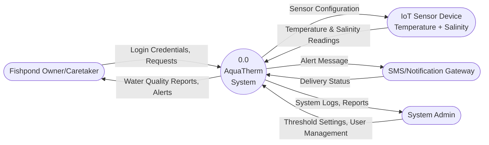
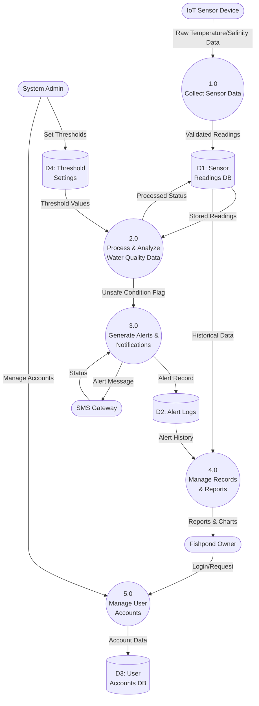
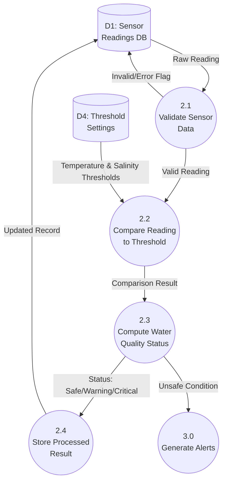

# Data Flow Diagram (DFD) — AquaTherm

> **Revision Note:** Per the adviser's feedback and the finalized Statement of Objectives, AquaTherm's sensor node monitors **water temperature** (via a waterproof DS18B20 digital temperature sensor) and **salinity** (via a salinity/conductivity sensor) — **not** dissolved oxygen (DO). All data flows, thresholds, and labels below have been updated accordingly.

## Level 0 — Context Diagram

### Explanation

The Level 0 (Context) Diagram presents AquaTherm as a single process (0.0) and shows how it interacts with the outside world. It answers the question: *what enters and leaves the system, and who/what is it exchanging data with?*

- **Fishpond Owner/Caretaker** — the primary end-user (e.g., Ms. Eli Alcantara, the study's partner-owner). The owner logs in and sends requests to the system, and in return receives water quality reports and real-time alerts through the mobile interface.
- **IoT Sensor Device (Temperature + Salinity)** — the ESP32-based sensor node installed at the fishpond. It continuously streams raw **water temperature** (°C, from the DS18B20 sensor) and **salinity** (ppt, from the salinity/conductivity sensor) readings into the system, and can receive sensor configuration data (e.g., reading interval) back from the system.
- **SMS/Notification Gateway** — the external service used to deliver SMS alerts. AquaTherm sends it the composed alert message and receives back a delivery status, satisfying the study's dual-channel (SMS + push notification) alerting objective.
- **System Admin** — the actor responsible for configuring Safe/Warning/Critical threshold ranges and managing user accounts. The system returns logs and reports to the admin for oversight.

This diagram intentionally hides internal processing — it only shows the system as one bubble — so it is used mainly to establish the system's boundary and its external dependencies before decomposing further.

---

## Level 1 — Main Processes

### Explanation

Level 1 breaks the single AquaTherm process from Level 0 into its five major functional processes, matching the five modules also reflected in the Structured Chart and HIPO diagram:

- **1.0 Collect Sensor Data** — receives the raw temperature and salinity signal from the IoT sensor node and passes validated readings into **D1: Sensor Readings DB**.
- **2.0 Process & Analyze Water Quality Data** — pulls stored readings from D1 together with the configured ranges in **D4: Threshold Settings**, computes a Safe/Warning/Critical status for both parameters, and writes the processed status back to D1. When a reading is Warning or Critical, it raises an *Unsafe Condition Flag* to Process 3.0.
- **3.0 Generate Alerts & Notifications** — triggered by the unsafe condition flag; it logs the alert to **D2: Alert Logs** and sends the composed message to the external SMS Gateway, tracking delivery status.
- **4.0 Manage Records & Reports** — aggregates historical readings (D1) and alert history (D2) into the charts and reports the owner sees on the mobile interface.
- **5.0 Manage User Accounts** — handles the owner's login/registration requests and stores account data in **D3: User Accounts DB**; the System Admin uses this same process to manage accounts and, separately, to set the threshold values stored in D4.

The four data stores (D1–D4) map directly to the ERD/Data Dictionary tables `SENSOR_READING`, `ALERT`, `USER`, and `NOTIFICATION_SETTING` respectively, keeping the DFD consistent with the system's actual database design.

---

## Level 2 — Decomposition of Process 2.0 (Process & Analyze Water Quality Data)

### Explanation

This diagram zooms into Process 2.0 — the core of AquaTherm's early-warning logic — since this is where raw sensor data becomes an actionable status:

1. **2.1 Validate Sensor Data** — checks that the incoming temperature (°C) and salinity (ppt) readings are complete and within plausible sensor bounds (e.g., not null, not a sensor fault reading). Invalid readings are flagged and written back to D1 for troubleshooting instead of being processed further.
2. **2.2 Compare Reading to Threshold** — retrieves the Safe/Warning/Critical boundary values for temperature and salinity from **D4: Threshold Settings** (populated by the Admin/Owner and, per the study's methodology, calibrated using baseline readings gathered at the partner fishpond) and compares each valid reading against those ranges.
3. **2.3 Compute Water Quality Status** — derives the final classification (`Safe`, `Warning`, or `Critical`) independently for temperature and for salinity.
4. **2.4 Store Processed Result** — persists the computed status alongside the raw values back into D1 (`SENSOR_READING.temperature_status`, `SENSOR_READING.salinity_status`).

Whenever either parameter's status resolves to `Warning` or `Critical`, an *Unsafe Condition* signal is passed to **Process 3.0 (Generate Alerts)**, which then handles composing and dispatching the SMS/push notification — this is the exact hand-off point where AquaTherm's early-warning function begins.
