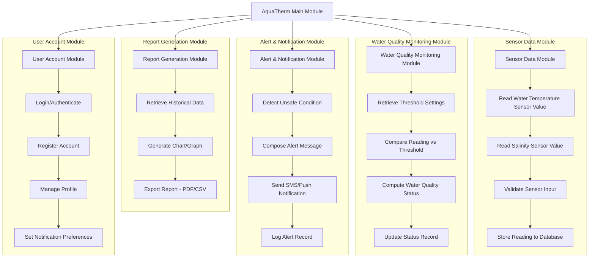

# Structured Chart — AquaTherm

> **Revision Note:** Updated to reflect the finalized sensor configuration — **water temperature (DS18B20)** and **salinity** — in place of dissolved oxygen (DO), per the adviser's revision.

## Module Descriptions

| Module | Function |
|---|---|
| Sensor Data Module | Handles reading, validating, and storing raw water temperature (via the DS18B20 waterproof digital sensor) and salinity (via the salinity/conductivity sensor) values from the ESP32-based IoT sensor node |
| Water Quality Monitoring Module | Compares sensor readings against the configured Safe/Warning/Critical thresholds and computes the current water quality status for both parameters |
| Alert & Notification Module | Detects unsafe conditions and triggers dual-channel (SMS + push) notifications to the fishpond owner |
| Report Generation Module | Produces historical charts, graphs, and exportable reports from stored sensor data |
| User Account Module | Manages login, registration, and account-level settings, including notification preferences |

## Explanation

The Structured Chart shows AquaTherm's software organized as a top-down hierarchy of callable modules, independent of timing or sequence — it answers *what functional units make up the system and how do they relate to one another*, which complements the DFD's focus on data movement.

- **Main Module** is the top-level control module that invokes each of the five subordinate modules as needed; it does not itself perform processing.
- **Sensor Data Module (A)** is the entry point for hardware data. Its four child steps run in sequence: read the temperature value from the DS18B20 probe, read the salinity value from the conductivity sensor, validate both readings for completeness/sanity, then persist them to the `SENSOR_READING` table — this directly implements the study's first objective (the ESP32 sensor node).
- **Water Quality Monitoring Module (B)** takes over once a reading is stored: it pulls the current threshold configuration (`NOTIFICATION_SETTING`), compares the new reading against it, computes the Safe/Warning/Critical classification, and updates the record — implementing the second objective (real-time classification on the mobile interface).
- **Alert & Notification Module (C)** is invoked only when Module B detects an unsafe condition. It composes a message describing the parameter and severity, dispatches it through both SMS and push notification channels, and logs the alert — implementing the third objective (dual-channel alerting).
- **Report Generation Module (D)** is invoked on-demand by the owner to turn historical readings and alert logs into charts and exportable reports.
- **User Account Module (E)** handles authentication and account/notification-preference management and is largely independent of the sensor pipeline, so it is drawn as a sibling rather than a downstream module.

Each subgraph's internal chain (e.g., A1 → A2 → A3 → A4) represents the *typical* call order for that module, while the top-level `Main --> A/B/C/D/E` fan-out shows that Main can invoke any module depending on the triggering event (a new sensor reading, an owner request, a scheduled report, etc.).
