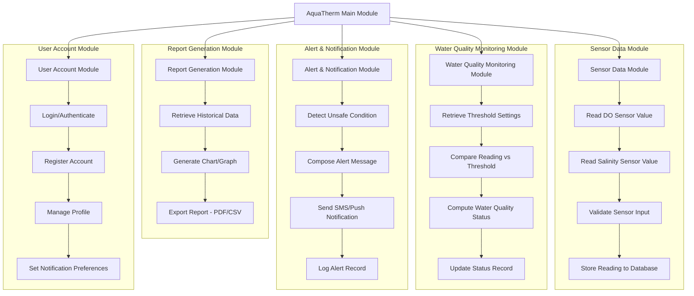

# Structured Chart — AquaTherm

## Module Descriptions

| Module | Function |
|---|---|
| Sensor Data Module | Handles reading, validating, and storing raw DO and salinity values from IoT sensors |
| Water Quality Monitoring Module | Compares sensor readings against defined thresholds and computes the current water quality status |
| Alert & Notification Module | Detects unsafe conditions and triggers SMS/push notifications to the fishpond owner |
| Report Generation Module | Produces historical charts, graphs, and exportable reports from stored sensor data |
| User Account Module | Manages login, registration, and account-level settings |
