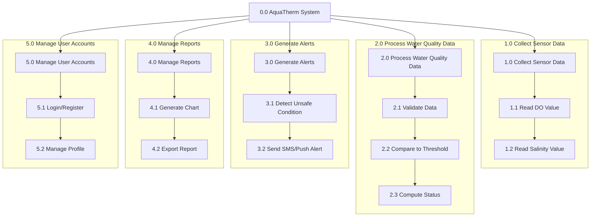

# HIPO (Hierarchy Input Process Output) Diagram — AquaTherm

## Hierarchy Chart

## IPO (Input-Process-Output) Table

| Process | Input | Process Description | Output |
|---|---|---|---|
| 1.0 Collect Sensor Data | Raw analog/digital signal from DO and salinity sensors | Reads and converts sensor signals into usable numeric values | Raw DO (mg/L) and Salinity (ppt) readings |
| 2.0 Process Water Quality Data | Raw sensor readings, threshold settings | Validates data, compares to safe/unsafe threshold ranges, computes status | Water quality status (Safe / Warning / Critical) |
| 3.0 Generate Alerts | Water quality status = Warning/Critical | Composes alert message and sends via SMS/push notification | Alert notification sent to fishpond owner, alert log entry |
| 4.0 Manage Reports | Historical sensor and alert data | Aggregates data into charts/graphs, formats exportable reports | Line/bar charts, PDF/CSV report file |
| 5.0 Manage User Accounts | Username, password, profile details | Authenticates login, manages registration and profile updates | Authenticated session, updated user profile |
