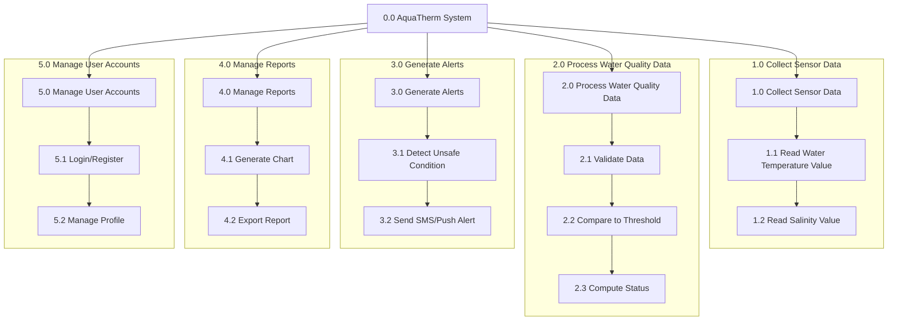

# HIPO (Hierarchy Input Process Output) Diagram — AquaTherm

> **Revision Note:** Updated to reflect the finalized sensor configuration — **water temperature (DS18B20)** and **salinity** — in place of dissolved oxygen (DO), per the adviser's revision.

## Hierarchy Chart

## IPO (Input-Process-Output) Table

| Process | Input | Process Description | Output |
|---|---|---|---|
| 1.0 Collect Sensor Data | Digital signal from the waterproof DS18B20 temperature sensor and the salinity/conductivity sensor, connected to the ESP32 microcontroller | Reads and converts sensor signals into usable numeric values at fixed intervals | Raw water temperature (°C) and salinity (ppt) readings |
| 2.0 Process Water Quality Data | Raw sensor readings, threshold settings | Validates data, compares to safe/unsafe threshold ranges, computes status | Water quality status (Safe / Warning / Critical) for temperature and salinity |
| 3.0 Generate Alerts | Water quality status = Warning/Critical | Composes alert message and sends via SMS/push notification | Alert notification sent to fishpond owner, alert log entry |
| 4.0 Manage Reports | Historical sensor and alert data | Aggregates data into charts/graphs, formats exportable reports | Line/bar charts, PDF/CSV report file |
| 5.0 Manage User Accounts | Username, password, profile details | Authenticates login, manages registration and profile updates | Authenticated session, updated user profile |

## Explanation

The HIPO diagram documents AquaTherm at two levels simultaneously: the **Hierarchy Chart** (visual, top-down decomposition of processes) and the **IPO Table** (textual detail of what goes into, happens inside, and comes out of each process). Together they satisfy the "quick design" phase of the Prototyping model described in the study's methodology, giving the researchers a shared overview before building the actual prototype.

- **1.0 Collect Sensor Data** corresponds to the physical IoT sensor node built around the ESP32 microcontroller. Its two sub-functions, **1.1 Read Water Temperature Value** and **1.2 Read Salinity Value**, map directly onto the two sensors named in the study's first objective — the DS18B20 waterproof digital temperature sensor and the salinity/conductivity sensor — each polled at a fixed interval and transmitted to the server over Wi-Fi (with local buffering as a fallback if the connection drops).
- **2.0 Process Water Quality Data** is where incoming values are validated, checked against the Safe/Warning/Critical threshold ranges configured in the system, and classified — the same logic detailed further in the Structured English and Pseudocode documents.
- **3.0 Generate Alerts** only executes when Process 2.0 flags a Warning or Critical status, and is responsible for the study's third objective: dual-channel (SMS + push notification) alerting to the fishpond owner.
- **4.0 Manage Reports** lets the owner review historical trends of temperature and salinity, and export them, supporting long-term recordkeeping beyond real-time alerting.
- **5.0 Manage User Accounts** covers authentication and profile management so that readings, alerts, and reports are always tied to the correct fishpond owner's account.

Reading the IPO table alongside the hierarchy chart clarifies not just *which* modules exist, but exactly *what data crosses each module's boundary* — which is what distinguishes a HIPO diagram from a plain structured/hierarchy chart.
