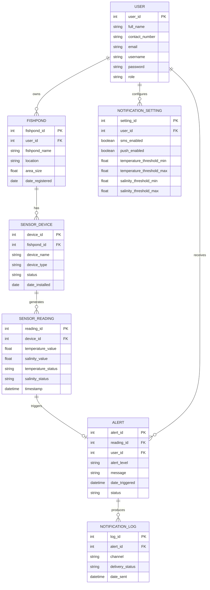

# Entity Relationship Diagram (ERD) — AquaTherm

> **Revision Note:** Updated to reflect the finalized sensor configuration — **water temperature (DS18B20)** and **salinity** — in place of dissolved oxygen (DO), per the adviser's revision. Affected fields: `SENSOR_DEVICE.device_type`, `SENSOR_READING.do_value` → `temperature_value`, `SENSOR_READING.do_status` → `temperature_status`, and `NOTIFICATION_SETTING.do_threshold_min/max` → `temperature_threshold_min/max`.

## Explanation

The ERD models the persistent data AquaTherm needs to support its four objectives — sensing, classification, alerting, and evaluation — as seven related entities:

- **USER ||--o{ FISHPOND (owns)** — one user (the fishpond owner) may register one or more fishponds; each fishpond belongs to exactly one owner. This supports the mobile interface being usable by an owner who may manage more than one pond in the future, while keeping every pond traceable to a single accountable user.
- **FISHPOND ||--o{ SENSOR_DEVICE (has)** — a fishpond can have one or more IoT sensor nodes installed (e.g., separate devices for different sections of a large pond); each device is installed at exactly one fishpond.
- **SENSOR_DEVICE ||--o{ SENSOR_READING (generates)** — each device continuously generates many timestamped readings over its operating life. `SENSOR_READING` is the direct digital counterpart of the study's first objective: it stores the `temperature_value` (°C, from the DS18B20 sensor) and `salinity_value` (ppt, from the salinity/conductivity sensor) captured every cycle, along with their computed `temperature_status` and `salinity_status`.
- **SENSOR_READING ||--o| ALERT (triggers)** — a reading *may* trigger at most one alert (zero-or-one), since most readings will be classified `Safe` and produce no alert at all; only Warning/Critical readings result in an `ALERT` row. This directly encodes Process 2.0/3.0's conditional hand-off from the Structured English and Pseudocode documents.
- **USER ||--o{ ALERT (receives)** — a user can receive many alerts over time, and every alert is addressed to exactly one user (the fishpond's registered owner), so the correct contact number can always be resolved for SMS delivery.
- **USER ||--o{ NOTIFICATION_SETTING (configures)** — each user configures their own notification preferences and threshold ranges; this is the table that stores the Safe/Warning/Critical boundaries (`temperature_threshold_min/max`, `salinity_threshold_min/max`) referenced throughout Processes 2.0 and 3.0, so thresholds are configurable per user rather than hard-coded.
- **ALERT ||--o{ NOTIFICATION_LOG (produces)** — each alert can produce multiple delivery attempts/records (one per channel — SMS and push notification), letting the system track delivery status independently per channel and satisfying the study's dual-channel alerting objective at the data level.

Every relationship uses crow's-foot notation to show cardinality: a single bar (`||`) means "exactly one," and a circle-and-crow's-foot (`o{`) means "zero or many," which together capture that ownership and configuration are one-to-many while an individual reading only *optionally* results in an alert.
