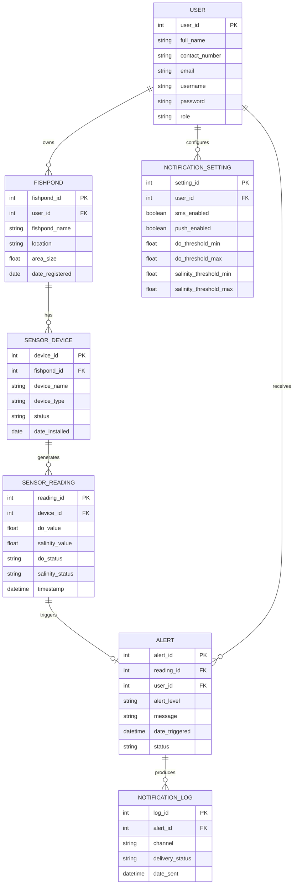

# Entity Relationship Diagram (ERD) — AquaTherm

```mermaid
erDiagram
    USER ||--o{ FISHPOND : owns
    FISHPOND ||--o{ SENSOR_DEVICE : has
    SENSOR_DEVICE ||--o{ SENSOR_READING : generates
    SENSOR_READING ||--o| ALERT : triggers
    USER ||--o{ ALERT : receives
    USER ||--o{ NOTIFICATION_SETTING : configures
    ALERT ||--o{ NOTIFICATION_LOG : produces

    USER {
        int user_id PK
        string full_name
        string contact_number
        string email
        string username
        string password
        string role
    }

    FISHPOND {
        int fishpond_id PK
        int user_id FK
        string fishpond_name
        string location
        float area_size
        date date_registered
    }

    SENSOR_DEVICE {
        int device_id PK
        int fishpond_id FK
        string device_name
        string device_type
        string status
        date date_installed
    }

    SENSOR_READING {
        int reading_id PK
        int device_id FK
        float do_value
        float salinity_value
        string do_status
        string salinity_status
        datetime timestamp
    }

    ALERT {
        int alert_id PK
        int reading_id FK
        int user_id FK
        string alert_level
        string message
        datetime date_triggered
        string status
    }

    NOTIFICATION_LOG {
        int log_id PK
        int alert_id FK
        string channel
        string delivery_status
        datetime date_sent
    }

    NOTIFICATION_SETTING {
        int setting_id PK
        int user_id FK
        boolean sms_enabled
        boolean push_enabled
        float do_threshold_min
        float do_threshold_max
        float salinity_threshold_min
        float salinity_threshold_max
    }
```
