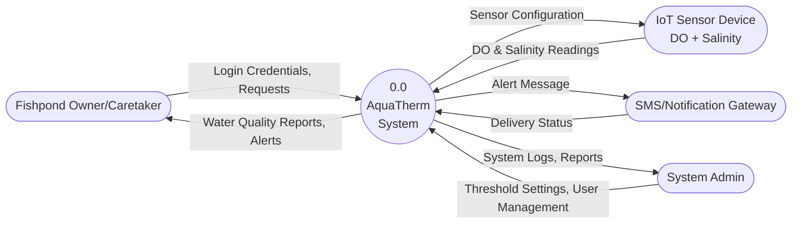
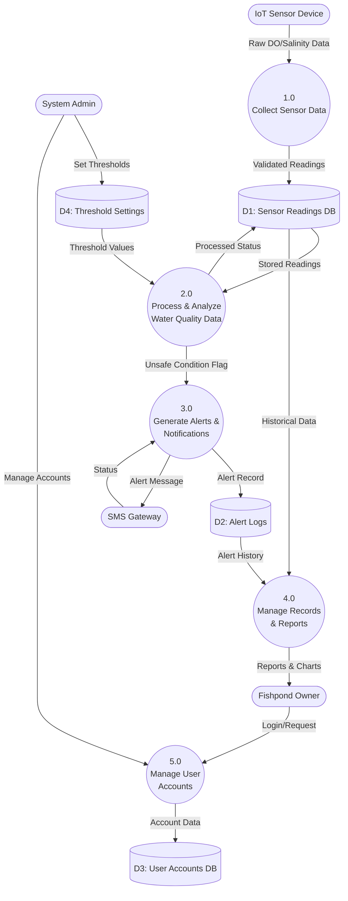
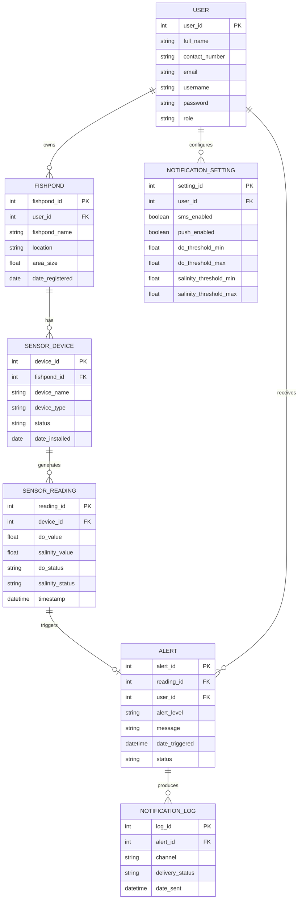

# AquaTherm
IoT-Based Water Quality Monitoring and Early Warning System for Bangus Fishponds — Thesis 1 Documentation

# AquaTherm
Leader: Avila, Kent Ivan B.
Members: Bacal, Emmanuel Joseph O.
Culminas, Gerardo R.
Daz, Yuan Dec L.
Llamido, John Michael J.


**AquaTherm** is an IoT-based water quality monitoring and early warning system for bangus (milkfish) fishponds. It continuously measures **dissolved oxygen (DO)** and **salinity**, classifies each reading as **Safe / Warning / Critical**, and automatically notifies the fishpond owner via **SMS and push notification** when conditions turn unsafe — so corrective action (e.g., aeration) can happen before a fish kill occurs.

---

## Table of Contents

- [Overview](#overview)
- [Key Features](#key-features)
- [System Architecture](#system-architecture)
  - [Context Diagram (DFD Level 0)](#context-diagram-dfd-level-0)
  - [Main Processes (DFD Level 1)](#main-processes-dfd-level-1)
- [Module Breakdown](#module-breakdown)
- [Monitoring & Alert Logic](#monitoring--alert-logic)
- [Database Design](#database-design)
- [Repository Structure](#repository-structure)
- [Documentation](#documentation)
- [Tech Stack](#tech-stack)
- [Roadmap](#roadmap)

---

## Overview

Fishpond owners typically rely on manual water testing or visual observation (fish gasping at the surface) to catch unsafe water conditions — a method that's too slow to catch sudden drops in dissolved oxygen or abnormal salinity swings, which are common causes of fish kills.

AquaTherm replaces that manual process with an always-on IoT sensor network that:

1. Reads DO and salinity from each fishpond at a fixed interval.
2. Compares each reading against configurable safe thresholds.
3. Stores the reading and computed status in a database.
4. Immediately alerts the owner (SMS + push notification) if a Warning or Critical condition is detected.
5. Lets owners and admins manage fishponds, devices, thresholds, and notification preferences, and review historical data and alert logs.

## Key Features

| Feature | Description |
|---|---|
| 🌊 Real-time sensor monitoring | Reads DO (mg/L) and salinity (ppt) from IoT devices installed per fishpond |
| ⚠️ Automatic status classification | Computes Safe / Warning / Critical status against configurable thresholds |
| 📩 Multi-channel alerts | Sends SMS and mobile push notifications when unsafe conditions are detected |
| 🗂️ Alert & notification logging | Tracks every alert triggered and its delivery status (Sent/Failed/Pending) |
| 📊 Historical reports | Supports charting/exporting historical sensor and alert data |
| 👤 User & device management | Owner/Admin accounts, multiple fishponds and devices per user, per-user notification settings |

## System Architecture

The system design follows standard structured-analysis artifacts (DFD, Structured Chart, HIPO, Structured English, Pseudocode, ERD, and Data Dictionary), all included in [`/docs`](#repository-structure).

### Context Diagram (DFD Level 0)



### Main Processes (DFD Level 1)



> Full decomposition (Level 2 of Process 2.0) is in [`docs/01_DFD.md`](docs/01_DFD.md).

## Module Breakdown

| Module | Function |
|---|---|
| **Sensor Data Module** | Reads, validates, and stores raw DO and salinity values from IoT sensors |
| **Water Quality Monitoring Module** | Compares readings against thresholds and computes Safe/Warning/Critical status |
| **Alert & Notification Module** | Detects unsafe conditions and triggers SMS/push notifications to the fishpond owner |
| **Report Generation Module** | Produces historical charts, graphs, and exportable (PDF/CSV) reports |
| **User Account Module** | Handles login, registration, profile, and notification preference management |

See [`docs/02_Structured_Chart.md`](docs/02_Structured_Chart.md) and [`docs/03_HIPO_Diagram.md`](docs/03_HIPO_Diagram.md) for the full hierarchy and IPO tables.

## Monitoring & Alert Logic

Each reading is classified using configurable thresholds (defaults below, per [`docs/05_Pseudo_Code.md`](docs/05_Pseudo_Code.md)):

| Parameter | Safe Range | Warning | Critical |
|---|---|---|---|
| Dissolved Oxygen (mg/L) | 4.0 – 8.0 | 3.0 – 4.0 | < 3.0 or > 8.0 |
| Salinity (ppt) | 12 – 35 | 10 – 12 | < 10 or > 35 |

**Default read interval:** every 5 minutes (300s), configurable per device.

Simplified flow (see [`docs/04_Structured_English.md`](docs/04_Structured_English.md) for the full spec):

```
Read DO & Salinity from sensor
  → Validate reading
  → Compare against thresholds → compute status (Safe/Warning/Critical)
  → Store reading + status in database
  → If status is Warning or Critical:
        → Compose alert message
        → Send SMS + push notification to owner
        → Log the alert and notification delivery status
```

## Database Design



Full field-level definitions (data types, sizes, constraints) are in [`docs/07_Data_Dictionary.md`](docs/07_Data_Dictionary.md).

## Repository Structure

```
AquaTherm/
├── README.md
└── docs/
    ├── 01_DFD.md               # Data Flow Diagrams (Level 0, 1, 2)
    ├── 02_Structured_Chart.md  # Module hierarchy & descriptions
    ├── 03_HIPO_Diagram.md      # Hierarchy + Input-Process-Output table
    ├── 04_Structured_English.md # Process specifications (2.0, 3.0)
    ├── 05_Pseudo_Code.md       # Microcontroller & server-side pseudocode
    ├── 06_ERD.md               # Entity Relationship Diagram
    └── 07_Data_Dictionary.md   # Table/field-level schema definitions
```

> Place the seven design documents in a `docs/` folder as shown above so the links in this README resolve correctly on GitHub.

## Documentation

| Doc | Description |
|---|---|
| [DFD](docs/01_DFD.md) | Context diagram and process decomposition (Levels 0–2) |
| [Structured Chart](docs/02_Structured_Chart.md) | Top-down module hierarchy and responsibilities |
| [HIPO Diagram](docs/03_HIPO_Diagram.md) | Hierarchy chart + Input-Process-Output table |
| [Structured English](docs/04_Structured_English.md) | Formal process specification for water quality processing & alerting |
| [Pseudocode](docs/05_Pseudo_Code.md) | Microcontroller loop and server-side alert logic |
| [ERD](docs/06_ERD.md) | Entity relationships across all 7 tables |
| [Data Dictionary](docs/07_Data_Dictionary.md) | Field names, data types, sizes, and constraints |

## Tech Stack

*Proposed, based on the system design — update once implementation begins.*

- **Sensors/Firmware:** Microcontroller (e.g., ESP32) + DO and salinity sensors, per the pseudocode's `READ_SENSOR` / `SEND_TO_SERVER` flow
- **Backend/Database:** Relational database (e.g., MySQL/PostgreSQL) matching the schema in the Data Dictionary
- **Notifications:** SMS gateway (GSM/GPRS or SMS API) + mobile push notifications
- **Client:** Mobile and/or web application for owners/admins (login, thresholds, reports)

## Roadmap

- [ ] Firmware for sensor data collection & transmission
- [ ] Backend API + database implementation
- [ ] Threshold evaluation & alert engine
- [ ] SMS/push notification integration
- [ ] Owner/admin mobile or web app
- [ ] Report generation (charts, PDF/CSV export)
